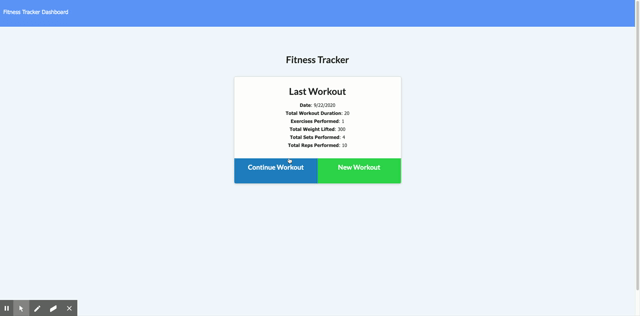

# Fitness Workout Tracker

## Description:
> How are you keeping track of your workouts? This fitness tracker helps keep records of your daily workouts to get you closer to that beach body! Technologies used for this app are javascript, node.js, mongoDB, mongoAtlas, and Heroku.

## Installation
npm install

node server.js

## Links
[Live Demo](https://fitness-workout-tracker-22.herokuapp.com/)

